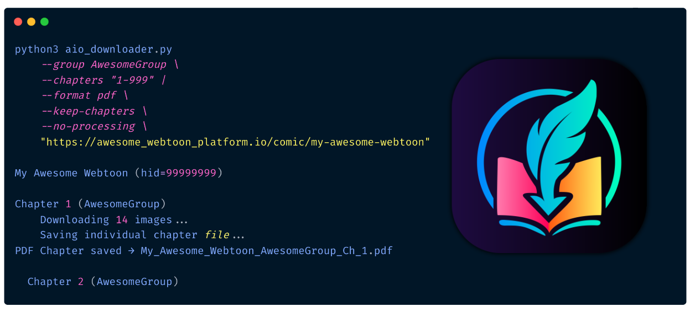

# AIO Webtoon & Light Novel Downloader 📚

[](https://www.python.org/) [](LICENSE) [](docs/SUPPORTED_SITES.MD)

A versatile, feature-rich command-line tool **and** desktop app for downloading webtoons, manga, comics, and light novels from 250+ sites — packaged into **PDF**, **EPUB**, **CBZ**, or raw chapter bundles. Includes cross-site search to find the best source for a series, multi-source download fallback for DMCA-affected catalogs, scanlation-group prioritization, an image-quality probe that ranks sources by visual fidelity, and a full Electron desktop UI.



> [!IMPORTANT]
> **Project status (May 2026)**: This is a major overhaul of the original CLI tool. Cross-site search, multi-source chapter fallback, an image-quality probe, and an Electron desktop UI are all new since the initial CLI release. If you're upgrading from an older version, the CLI flags are backwards-compatible — but `--search` and `--multi-source` are the recommended entry points now.

---

## 📑 Table of Contents

- [🚀 Features](#-features)
- [🛠️ Requirements](#%EF%B8%8F-requirements)
- [🌐 Supported Sites](#-supported-sites)
- [🧰 Installation](#-installation)
  - [CLI](#cli)
  - [Desktop UI (Electron)](#desktop-ui-electron)
- [🚀 Usage](#-usage)
- [🔎 Cross-Site Search](#-cross-site-search)
- [🌉 Multi-Source Mode](#-multi-source-mode)
- [🖥️ Desktop UI](#%EF%B8%8F-desktop-ui)
- [⚙️ Options](#%EF%B8%8F-options)
- [🔐 Cookie Setup](#-cookie-setup)
- [📖 Examples](#-examples)
- [💡 Tips & Tricks](#-tips--tricks)
- [📁 Output Structure](#-output-structure)
- [⚖️ Disclaimer](#%EF%B8%8F-disclaimer)
- [🤝 Contributing](#-contributing)
- [🙏 Acknowledgements](#-acknowledgements)
- [📄 License](#-license)

---

## 🚀 Features

### Core download engine
- 📥 **Flexible chapter selection** — single (`5`), range (`1-10`), or list/ranges (`1,3,5-7`); skip fractional chapters with `--no-partials`.
- 🏷️ **Scanlation group control** — prioritize groups (`--group "Asura,Drake"`); pick by upvote with `--mix-by-upvote`.
- 🖼️ **Smart page processing** — resize, scale, recombine, compress; webtoon strips stay continuous, page-style scans keep their layout.
- 🚫 **No-processing mode** — package raw pages exactly as downloaded with `--no-processing`.
- 📁 **Multiple output formats** — PDF, fixed-layout EPUB, vertical-scroll EPUB, CBZ, or per-chapter `.txt` for prose.
- 📚 **Light-novel friendly** — auto-detects prose chapters; EPUB embeds true XHTML, PDF outputs selectable text, `.txt` mode preserves source.
- 🔄 **Resumable downloads** — automatically picks up where it left off after an interruption.
- ✂️ **Book splitting** — split by file size (`400MB`) or chapter count (`10ch`).
- 💾 **Keep originals** — `--keep-images` retains raw downloads; `--keep-chapters` saves per-chapter files alongside the combined book.
- ⚡ **Parallel image downloads** — `--image-workers` controls per-chapter parallelism; `--prefetch-image-workers` overlaps download of chapter N+1 with encoding of chapter N.
- 🎯 **Per-chapter strict mode** — zero-tolerance for partial chapters: missing-page detection triggers inline retry with exponential backoff (`--inline-chapter-retries`, `--chapter-deadline-seconds`).

### Cross-site features
- 🔎 **Cross-site search** — `--search "Witch Hat Atelier"` fans out across 280+ search-capable handlers, scores title matches with rapidfuzz, ranks by image-quality priors, returns ranked candidates as JSON. See [Cross-Site Search](#-cross-site-search).
- 🌉 **Multi-source download fallback** — `--multi-source` pre-fetches chapter lists from alternative sites; if your primary source 520s on chapter 47, it transparently swaps to an alternative. Especially useful for DMCA-affected catalogs (MangaDex's licensed-series hollowing). See [Multi-Source Mode](#-multi-source-mode).
- 🏛️ **Official-publisher detection** — recognizes MangaDex group UUIDs for Yen Press, Viz, Kodansha, etc.; chapters from licensed publishers are tagged with `is_official` and prioritized in chapter merging.
- 📊 **Image-quality probe** — per-site visual-fidelity priors (curated in `sites/quality_seed.json`) used as a tiebreaker when title-match scores are close. Reduces the chance of a high-text-match-but-low-resolution source ranking #1.

### Desktop UI
- 🖥️ **Electron desktop app** — full GUI under `UI-source/` with tabs for Download, Search, Queue, Logs, Library, and Settings; system-aware light/dark theme; one-click installer for Windows.

### Robustness
- 🤖 **Concurrent multi-URL downloads** — `--jobs N` runs up to N downloads in parallel as separate processes (Playwright-safe).
- 🛡️ **Cross-process coordination** — shared rate-limit state across worker processes via `--coord-dir`; CDN-friendly minimum gap between requests.
- 🧪 **Test suite** — pytest coverage for chapter merger, search orchestrator, and key handlers under `tests/`.

---

## 🛠️ Requirements

- **Python 3.8+** (officially supported); 3.7 best-effort, may need to build Pillow from source on some platforms.
- **Node.js 20+** (only if you want to build/run the Electron desktop UI).
- **OS**: Windows, macOS, Linux.

### Python packages

Runtime (`requirements.txt`):
```
beautifulsoup4
cloudscraper
lxml
Pillow
pypdf
requests
patchright>=1.40.0    # Superseeds playwright
[playwright>=1.40.0   # MangaFire VRF generation, image-quality probe]
rapidfuzz             # Cross-site search title matching
pywidevine            # Kagane DRM (optional; install only if using Kagane)
cryptography          # Pywidevine dependency
```

After `pip install`, run `playwright install chromium` once to fetch the browser binary.

Development (`requirements-dev.txt`):
```
pytest>=7.4
pytest-mock>=3.12
```

### Feature support by Python version

| Python | PDF | EPUB | CBZ | Resume | Search | Multi-source | Playwright (MangaFire) |
| ------ | --- | ---- | --- | ------ | ------ | ------------ | ---------------------- |
| 3.13   | ✅  | ✅   | ✅  | ✅     | ✅     | ✅           | ✅                     |
| 3.12   | ✅  | ✅   | ✅  | ✅     | ✅     | ✅           | ✅                     |
| 3.11   | ✅  | ✅   | ✅  | ✅     | ✅     | ✅           | ✅                     |
| 3.10   | ✅  | ✅   | ✅  | ✅     | ✅     | ✅           | ✅                     |
| 3.9    | ✅  | ✅   | ✅  | ✅     | ✅     | ✅           | ✅                     |
| 3.8    | ✅  | ✅   | ✅  | ✅     | ✅     | ✅           | ✅                     |
| 3.7    | ✅  | ✅   | ✅  | ✅     | ⚠️     | ⚠️           | ⚠️                     |
| ≤ 3.6  | ❌  | ❌   | ❌  | ❌     | ❌     | ❌           | ❌                     |

⚠️ on 3.7: rapidfuzz wheels may not be available; falls back to slower pure-Python matching. Playwright requires 3.8+.

---

## 🌐 Supported Sites

**250+ sites** are supported across dedicated handlers and the unified Madara/MangaThemesia frameworks. The full list with last-checked status lives in [docs/SUPPORTED_SITES.MD](docs/SUPPORTED_SITES.MD).

**Top-tier sources** (dedicated handlers, search-capable):

| Site | Notes |
| ---- | ----- |
| [mangadex.org](https://mangadex.org) | Scanlation-group selection; official-publisher detection (Yen Press, Viz, Kodansha, etc.) |
| [mangafire.to](https://mangafire.to) | Multi-language; uses Playwright VRF bridge for search |
| [weebcentral.com](https://weebcentral.com) | Group selection; reliable mirror for many series |
| [mangataro.org](https://mangataro.org) | Group selection; stripped boilerplate (banners, avatars) |
| [bato.to](https://bato.to) | Multi-mirror support |
| [comix.to](https://comix.to) | Multi-group |
| [asuracomic.net](https://asuracomic.net) | Alternative mirror at asurascans.net |
| [flamecomics.xyz](https://flamecomics.xyz) | High-resolution scans |
| [omegascans.com](https://omegascans.com) | Manhwa-focused |
| [voyce.me](https://voyce.me) | Original webtoons + scanlations |
| [tcbscans.com](https://tcbscans.com) | Weekly Shonen Jump scanlations |
| [dynasty-scans.com](https://dynasty-scans.com) | Yuri-focused archive |
| [atsu.moe (Atsumaru)](https://atsu.moe) | WebP-native, requires custom PDF encoding |
| [mangahub.io](https://mangahub.io) | |
| [manganato.gg](https://www.manganato.gg) | MangaKakalot/MangaNato family of mirrors |
| [mangakatana.com](https://mangakatana.com) | |
| [mangapill.com](https://mangapill.com) | |
| [mangareader.to](https://mangareader.to) | |
| [manhuaplus.com](https://manhuaplus.com) | |
| [manhuaus.com](https://manhuaus.com) | |
| [zeroscans.com](https://zeroscans.com) | |
| [kagane.org](https://kagane.org) | DRM-protected — requires Widevine `.wvd`. See [docs/Widevine.md](docs/Widevine.md). |

**Framework-supported** (auto-detected via Madara / MangaThemesia engines): Toonily, ArcaneScans, FlameScans, RizzFables, RizzComic, BoratScans, VioletScans, TecnoXMoon, ArtLapsa, ArcRelight, SumManga, MangaBin, MangaBuddy, plus 240+ more — see [docs/SUPPORTED_SITES.MD](docs/SUPPORTED_SITES.MD).

---

## 🧰 Installation

### CLI

```bash
git clone https://github.com/zzyil/AIO-Webtoon-Downloader.git
cd AIO-Webtoon-Downloader
python3 -m pip install -r requirements.txt
python3 -m playwright install chromium    # one-time, for MangaFire + quality probe
```

Verify:
```bash
python3 aio-dl.py --help
```

### Desktop UI (Electron)

```bash
cd UI-source
npm install
npm run electron:dev       # development mode (hot reload)
# OR — produce a per-OS installer under release/:
npm run dist:win           # Windows  → AIO Downloader Setup *.exe (NSIS)
npm run dist:mac           # macOS    → AIO Downloader-*-{x64,arm64}.dmg
npm run dist:linux         # Linux    → AIO-Downloader-*.AppImage
```

`dist:mac` requires a macOS host (DMG creation needs `hdiutil`). `dist:linux` and `dist:win` can run anywhere. The repo's `.github/workflows/release.yml` runs all three in parallel on tag push and produces a draft GitHub Release.

The `prepare-src.js` step (run automatically) bundles the Python backend into the installer as `extraResources`. The installed app spawns `aio-dl.py` as a subprocess; no separate Python install is needed for end users.

#### First-run cost on Unix

The setup wizard downloads ~30 MB of relocatable Python from [astral-sh/python-build-standalone](https://github.com/astral-sh/python-build-standalone) into the platform's user-data folder, then ~150 MB of Chromium for Patchright:

| OS      | python-env location                                            |
| ------- | -------------------------------------------------------------- |
| Windows | `%APPDATA%\aio-downloader-ui\python-env\`                      |
| macOS   | `~/Library/Application Support/aio-downloader-ui/python-env/`  |
| Linux   | `~/.config/aio-downloader-ui/python-env/`                      |

Total first-run cost: ~200 MB and a few minutes. Subsequent launches skip the wizard.

#### Running an unsigned macOS build

The macOS DMGs are not notarized (no Apple Developer cert). On first launch Gatekeeper blocks the app with *"AIO Downloader cannot be opened because the developer cannot be verified"*. To allow it once:

1. Open `Applications` in Finder, right-click `AIO Downloader.app` → **Open** → **Open** (one-time bypass), **or**
2. *System Settings* → *Privacy & Security* → scroll to "AIO Downloader was blocked" → **Open Anyway**.

#### Running the Linux AppImage

```bash
chmod +x AIO-Downloader-*.AppImage
./AIO-Downloader-*.AppImage
```

Minimal distros without FUSE need it once: `sudo apt install libfuse2` (Ubuntu 22.04+) or the equivalent for your distro.

---

## 🚀 Usage

### Direct URL (classic)

```bash
python3 aio-dl.py [OPTIONS] COMIC_URL
```

### Cross-site search → auto-pick → download

```bash
python3 aio-dl.py --search "Witch Hat Atelier" --auto-pick --multi-source
```

This searches 280+ handlers for the title, picks the highest-ranked candidate, pre-fetches alternative sources for fallback, then downloads.

### List chapters as JSON (no download)

```bash
python3 aio-dl.py --list-chapters "https://..."
```

### Build a final book from existing per-chapter PDFs (no downloading)

```bash
python3 aio-dl.py --build-final-file --format pdf path/to/chapter/folder
```

### Multiple URLs in parallel

```bash
python3 aio-dl.py --jobs 3 "URL1" "URL2" "URL3"
```

Or pipe URLs from stdin: `python3 aio-dl.py --prompt-urls`

Run `python3 aio-dl.py --help` for the full option reference.

---

## 🔎 Cross-Site Search

Pass `--search "<title>"` and the orchestrator (`sites/search_orchestrator.py`) fans out across every search-capable handler. Each handler runs its own scraper (so per-handler header/cookie state doesn't collide), reports candidate URLs + titles, and the orchestrator scores them with `rapidfuzz` WRatio, dedupes, and ranks.

**Output** without `--auto-pick` is JSON to stdout — ranked candidates with score, source site, URL, language, and image-quality prior. Use `--auto-pick` to download the top hit, or feed the JSON to your own UI.

**Key flags**:

| Flag | Default | Purpose |
| ---- | ------- | ------- |
| `--search QUERY` | — | Run search across all search-capable handlers |
| `--auto-pick` | off | Download the top-ranked candidate end-to-end |
| `--search-language CODE` | (uses `--language`) | Filter results by language; `all` to disable |
| `--search-parallelism N` | 6 | How many sites to probe in parallel |
| `--search-timeout SECONDS` | 20.0 | Per-site timeout — slow sites self-select out |
| `--search-min-match SCORE` | 0.55 | Drop hits below this WRatio similarity (0.0–1.0) |
| `--search-json` | off | Force JSON output even with `--auto-pick` (UI integrations) |
| `--seeded-only` | off | Restrict to handlers with a curated quality seed; significantly faster |

**Failure isolation**: a handler that times out twice within an hour is suppressed for 1 hour via the same `_record_rate_limit` machinery used for normal request cooldowns — no parallel cooldown system. So one slow site doesn't keep dragging down every search.

---

## 🌉 Multi-Source Mode

Some catalogs are hollowed out. MangaDex's May 2025 DMCA wave removed ~25% of chapters for licensed series like *Witch Hat Atelier*, *Frieren*, and *Eleceed*, leaving the chapter list incomplete. `--multi-source` solves this by pre-fetching chapter lists from alternative sources, building a unified chapter map, and using alternatives as **per-chapter download fallback** when the primary source fails.

**How it works**:
1. Search (or direct URL) yields a primary source.
2. Multi-source pre-fetch finds alternative sources for the same series; only sources above `--multi-source-quality-min` (default 0.65) qualify.
3. `sites/chapter_merger.py` runs strict-label alignment to build a unified `chapter_number → [(source, url)]` map.
4. The chapter download loop tries the primary; on `ChapterSkippedError` (CDN 520, missing page, host poison, etc.), it transparently swaps to the next-best alternative without re-fetching anything.

**Key flags**:

| Flag | Default | Purpose |
| ---- | ------- | ------- |
| `--multi-source` | off | Enable cross-site multi-source mode |
| `--multi-source-quality-min` | 0.65 | Min seed/probe quality for an alt source to qualify |
| `--no-collapse-splits` | off | Disable `1.1/1.2/1.3 → 1` collapse in coverage diagnostics |
| `--multi-source-prefetched FILE` | — | Skip the search step; use pre-discovered alternatives from JSON |

When `--multi-source --auto-pick` runs, stderr emits a coverage summary like `MangaDex: 102 ch / Asura: 387 ch / Mangafire: 392 ch`, making DMCA hollowing visible at a glance.

---

## 🖥️ Desktop UI

Under `UI-source/` is a full Electron + React + Vite + Tailwind desktop application. It drives `aio-dl.py` via subprocess — no embedded Python interpreter, no shared address space, just stdin/stdout/argv.

**Tabs**:
- **New** — single-URL or paste-multiple downloads with format/quality/group config.
- **Search** — cross-site search panel; results show per-source rank, score, image-quality prior, and a chapter-coverage bar.
- **Queue** — pause/resume/cancel running and queued downloads; progress bars per book.
- **Logs** — per-job stdout/stderr stream from `aio-dl.py`.
- **Library** — manage downloaded books on disk; rename, re-process, delete.
- **Settings** — Python interpreter selection, default paths, group preferences, theme.

**Build artifacts**: `npm run dist:win` / `dist:mac` / `dist:linux` produce per-OS installers under `UI-source/release/` (Windows NSIS `.exe`, macOS `.dmg` for x64+arm64, Linux `.AppImage`). See *Installation → Desktop UI* above for first-run setup details and the macOS Gatekeeper bypass for unsigned builds. CI builds all three on every tag via `.github/workflows/release.yml`.

**Architecture note**: each Electron bridge module (`electron/downloader.js`, `electron/searcher.js`, `electron/library.js`, `electron/history.js`) is a thin wrapper around `child_process.spawn(python, ['aio-dl.py', ...])` with stdout/stderr parsers that turn `aio-dl.py`'s log lines into structured IPC events for the React renderer. If you change a CLI flag, the bridge usually needs a matching update — see `useDownloader.js:buildCliArgs`.

---

## ⚙️ Options

A curated list — run `python3 aio-dl.py --help` for the full set (~50 flags).

| Option                          | Default     | Description |
| ------------------------------- | ----------- | ----------- |
| `COMIC_URL`                     | _required_  | One or more URLs (e.g., `https://mangataro.org/series/...`) |
| `--search QUERY`                | —           | Cross-site search; see [Cross-Site Search](#-cross-site-search) |
| `--auto-pick`                   | off         | With `--search`: download the top-ranked candidate |
| `--multi-source`                | off         | Enable cross-site chapter fallback |
| `--jobs N`                      | 1           | Concurrent multi-URL downloads (separate processes) |
| `--prompt-urls`                 | off         | Read URLs from stdin, one per line |
| `--cookies "k=v; k=v"`          | `""`        | HTTP cookie string for restricted content |
| `--group "GROUP[,GROUP...]"`    | `[]`        | Preferred scanlation groups (priority order) |
| `--mix-by-upvote`               | off         | Pick highest-upvoted version among `--group` |
| `--no-partials`                 | off         | Skip fractional chapters (1.5, 60.1) |
| `--chapters EXPR`               | `all`       | `5`, `1-10`, `1,3,5-7`, or `all` |
| `--language CODE`               | `en`        | Language filter (`en`, `ja`, etc.) |
| `--format {pdf,epub,cbz,none}`  | `epub`      | Output format; `none` = raw `.txt` for prose |
| `--epub-layout {page,vertical}` | `vertical`  | EPUB layout |
| `--width PX`                    | _auto_      | Base image width |
| `--aspect-ratio W:H`            | _auto_      | Target aspect ratio (not used for PDF) |
| `--quality 1-100`               | 85          | JPEG quality |
| `--scaling 1-100`               | 100         | Final image scale % |
| `--no-processing`               | off         | Skip resize/recombine/scale; pass-through originals |
| `--split STRING`                | —           | Split by size (`400MB`) or chapter count (`10ch`) |
| `--restore-parameters`          | off         | Reuse saved processing settings (format-only reassembly) |
| `--keep-images`                 | off         | Retain raw downloads under `mangas/<Title>/Chapter_<n>/` |
| `--keep-chapters`               | off         | Save per-chapter file alongside combined book |
| `--no-final-file`               | off         | With `--keep-chapters`: skip combined-file build |
| `--build-final-file`            | off         | Standalone: combine existing chapter PDFs into one book |
| `--list-chapters`               | off         | Print chapter list + metadata as JSON, exit |
| `--no-cleanup`                  | off         | Keep `tmp_<hid>/` after completion (debugging / resume) |
| `--image-workers N`             | 3           | Parallel image downloads per chapter |
| `--prefetch-image-workers N`    | -1 (auto)   | Prefetch chapter N+1 while encoding N (0 = disable) |
| `--inline-chapter-retries N`    | 2           | Retries before aborting on a chapter with missing pages |
| `--chapter-deadline-seconds N`  | 90          | Per-chapter wall-clock budget |
| `-v, --verbose`                 | off         | Step-by-step progress logging |
| `-d, --debug`                   | off         | Image-processing debug logging |

---

## 🔐 Cookie Setup

For sites that gate adult or premium content, export your cookies:

```bash
export COOKIES='session_token=…; another_cookie=…'
python3 aio-dl.py --cookies "$COOKIES" "https://..."
```

Most browsers have an "Export cookies for current site" extension. The script auto-detects which site to target from the URL — you do **not** need to pass `--site`.

---

## 📖 Examples

### 1. Find and download via cross-site search (recommended)

```bash
python3 aio-dl.py \
  --search "Witch Hat Atelier" \
  --auto-pick \
  --multi-source \
  --format epub --epub-layout page \
  --quality 92
```

Searches all sites, picks the best-ranked source, pre-fetches alternatives for fallback, downloads as page-layout EPUB at quality 92.

### 2. Page-layout EPUB, chapters 1–10, prefer Asura group

```bash
python3 aio-dl.py \
  --group Asura \
  --chapters "1-10" \
  --format epub --epub-layout page \
  --verbose \
  "https://mangataro.org/series/example"
```

### 3. Vertical EPUB, all chapters, split into 10-chapter parts

```bash
python3 aio-dl.py \
  --format epub --epub-layout vertical \
  --split 10ch \
  "https://weebcentral.com/series/example"
```

### 4. Per-chapter CBZ files (one CBZ per chapter)

```bash
python3 aio-dl.py \
  --chapters "1-50" \
  --format cbz \
  --keep-chapters \
  "https://example.com/manga"
```

### 5. Raw CBZ — pages copied as-is, no resizing/re-encoding

```bash
python3 aio-dl.py \
  --chapters "1-20" \
  --format cbz \
  --no-processing \
  "https://example.com/manga"
```

This is the fastest path for archival use; the original wire bytes are preserved.

### 6. Concurrent downloads of multiple series

```bash
python3 aio-dl.py --jobs 3 \
  "https://example.com/series-a" \
  "https://example.com/series-b" \
  "https://example.com/series-c"
```

Three downloads run in parallel as separate processes; cross-process rate limiting via the coordination directory keeps from hammering CDNs.

### 7. List a series' chapters as JSON (no download)

```bash
python3 aio-dl.py --list-chapters "https://mangadex.org/title/..."
```

Output is a single JSON object: `{ title, chapters: [{ number, name, url, group, language, ... }] }`. Useful for piping into UIs.

---

## 💡 Tips & Tricks

- 🔄 **Ongoing series** — re-run the same command; resume picks up new chapters automatically. Combine with `--no-cleanup` + `--restore-parameters` to keep all settings between runs.
- 📚 **DMCA-affected series** — always pair `--search` or a direct MangaDex URL with `--multi-source`. If MangaDex has 102 chapters and Asura has 387, multi-source uses Asura for chapters MangaDex is missing, transparently.
- 🍏 **Apple Books** — choke on huge EPUBs; use `--split 10ch` or `--split 200MB`.
- 🎨 **Quality vs. size** — `--quality 60` + `--scaling 80` cuts file size dramatically with minimal visual loss. `--no-cbz-preserve-originals` forces re-encoding even when you'd otherwise pass-through.
- 🏷️ **Group preference** — `--group "GroupA, GroupB"` falls through in priority order. Add `--mix-by-upvote` to instead pick the most-upvoted version across those groups per chapter.
- ⚡ **CDN throttling** — if you see Cloudflare 5xx storms, drop `--prefetch-image-workers 0` and `--image-workers 1` to serialize requests.
- 🛡️ **Robust failure recovery** — `--inline-chapter-retries 3 --inline-chapter-backoff 60` gives chapters with intermittent missing pages three retries with growing backoff (60s, 120s, 240s) before aborting the run.
- 🔍 **Debugging** — `-v` for step-by-step, `-d` for deep image-processing logs. The temp folder under `tmp_<hid>/` keeps `run_meta.json` with everything the run knew.
- 📦 **Per-chapter EPUB/PDF** — `--keep-chapters --no-final-file` skips the combined-book build entirely; useful if your reader prefers individual files.

---

## 📁 Output Structure

```
mangas/                              # Final destination (configurable)
├── <Title>[_Groups]_Ch_a-b.epub     # Combined book
├── <Title>/Chapter_<n>.epub         # Per-chapter (if --keep-chapters)
└── <Title>/Chapter_<n>/             # Raw images (if --keep-images)
    ├── 001.jpg
    ├── 002.jpg
    └── ...
tmp_<hid>/                           # Temporary workspace (auto-cleaned)
├── run_params.json                  # Settings snapshot for --restore-parameters
├── run_meta.json                    # Run telemetry (chapter counts, timings, errors)
└── ch_<n>/                          # Per-chapter scratch area
mangas/.aio_coord/                   # Cross-process coordination state (--jobs)
```

- Use `--no-cleanup` to inspect `tmp_<hid>/` after a run.
- Re-run with `--restore-parameters` + a different `--format` to re-package without re-downloading.

---

## ⚖️ Disclaimer

This tool is provided strictly for educational purposes and to help you create personal, offline backups of manga to which you have legal access. Many supported sites are unauthorized aggregators of licensed content; for those, the official-publisher detection in MangaDex mode actively warns when a series has a licensed English release available. **Please buy legitimate releases when available** — the manga industry depends on it. Unauthorized sharing, piracy, or redistribution of downloaded content is prohibited.

---

## 🤝 Contributing

1. Fork the repo
2. Create a feature branch (`git checkout -b feature/foo`)
3. Add a handler under `sites/` or extend the orchestrator under `sites/search_orchestrator.py`
4. Run the test suite: `pytest tests/`
5. For new handlers, override `search()` so the new site joins the cross-site search fan-out
6. Commit, push, open a pull request

**Adding a new site handler** — copy an existing handler from `sites/` (the simpler ones like `voyceme.py` or `mangapill.py` are good templates), implement `configure_session`, `fetch_comic_context`, `get_chapters`, `get_chapter_images`, and optionally `search`. Register the class in `sites/__init__.py`. Madara/MangaThemesia-based sites can usually be added by appending to `MADARA_EXTRA_SITES` or `MANGATHEMESIA_SITES` instead of writing a new handler.

---

## 🙏 Acknowledgements

This project stands on the shoulders of many open-source tools:

**Core**:
- [Python](https://github.com/python/cpython) — the language
- [requests](https://github.com/psf/requests) — HTTP for humans
- [cloudscraper](https://github.com/VeNoMouS/cloudscraper) — Cloudflare anti-bot bypass
- [Beautiful Soup](https://www.crummy.com/software/BeautifulSoup/) — HTML/XML parsing
- [lxml](https://github.com/lxml/lxml) — fast XML/HTML processing
- [Pillow](https://github.com/python-pillow/Pillow) — image manipulation
- [pypdf](https://github.com/py-pdf/pypdf) — PDF generation

**Cross-site features**:
- [rapidfuzz](https://github.com/rapidfuzz/RapidFuzz) — fast fuzzy string matching for title scoring
- [Playwright](https://github.com/microsoft/playwright) — headless browser for MangaFire VRF + image-quality probe
- [pywidevine](https://github.com/devine-dl/pywidevine) — Widevine DRM decryption (Kagane)

**Desktop UI**:
- [Electron](https://github.com/electron/electron) — native window shell
- [React](https://github.com/facebook/react) + [Vite](https://github.com/vitejs/vite) — renderer framework
- [Tailwind CSS](https://github.com/tailwindlabs/tailwindcss) — styling
- [lucide-react](https://github.com/lucide-icons/lucide) — icons

---

## 📄 License

This project is licensed under the [GNU GPLv3](LICENSE).

---
